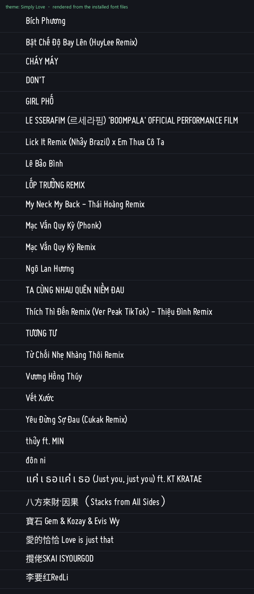

# ITGMania-CharacterSupport

A standalone patcher that adds **Vietnamese, Thai, Korean and Chinese** glyph
coverage to StepMania / ITGmania themes, so song titles in those scripts stop
rendering as blanks.

It generates the missing font pages **on your machine, from fonts you already
have**, and wires them into the theme with a single import line. Nothing is
replaced, nothing is overwritten, and `uninstall` puts everything back.



---

## The problem

Song titles are stored as UTF-8 and the engine **never strips diacritics** —
there is no normalisation or accent-folding anywhere in ITGmania's `src/`. What
looks like mojibake or missing accents is almost always a bitmap font with no
glyph for that codepoint, falling through to the blank "missing" glyph.

Four separate gaps, each with a different cause:

| Script | What is actually wrong |
|---|---|
| **Vietnamese** | No glyphs at all for `U+1EA0–U+1EF9`, nor for the horn letters `Ơ ơ Ư ư`. Latin-1 accents work, so `CHÁY MÁY` renders but `Vết Xước` does not. |
| **Thai** | `_Thai 16px` ships in `_fallback` but Simply Love never imports it. Even when reached, it uses `Baseline=36 / LineSpacing=36` against a body font at `19 / 24`. |
| **Korean** | The shipped `_korean 24px` pages are named `[jamo 1..4]` but contain no jamo — they are ~246 hand-picked precomposed syllables. Most Hangul is simply absent. |
| **Chinese** | There is no Chinese font. `_chinese 24px` is 126 hand-picked UI words (`鍵輯按箭這玩…`) for translating the StepMania interface. Chinese text is rendered by the **Japanese JIS kanji** pages, which cover most traditional forms and almost no PRC-simplified ones. |

Measured against a stock install, before patching:

```
Big5   (traditional common)  13,061 chars →  5,554 covered,  7,507 missing (57%)
GB2312 (simplified common)    6,763 chars →  3,390 covered,  3,373 missing (50%)
Hangul syllables             11,172 chars →    246 covered, 10,926 missing (98%)
Vietnamese                       94 chars →      0 covered,     94 missing
```

---

## Install

Requires **Python 3** and **Pillow**. `fonttools` is optional — it is only used
to read a source font's licence string.

```bash
pip install -r requirements.txt
```

```bash
python fontpatch.py scan        # what is missing, per theme
python fontpatch.py install     # generate the pages and wire them in
python fontpatch.py verify      # confirm nothing has drifted
python fontpatch.py preview     # render proof from the installed files
python fontpatch.py uninstall   # restore everything, leaves no trace
```

`install` is idempotent — run it as often as you like, and again after a theme
update. See [Surviving updates](#surviving-updates).

Every command takes `--root PATH` (repeatable) to point at a specific install
instead of searching the usual locations. The path must exist and contain a
`Themes` folder, otherwise the tool stops with exit code 2 before touching
anything.

### Without Python: `Repair-FontPatch.ps1`

```powershell
.\Repair-FontPatch.ps1                         # fix + check every theme
.\Repair-FontPatch.ps1 -Root C:\Games\ITGmania -Theme "Simply Love" -WhatIf
```

Works in Windows PowerShell 5.1 and PowerShell 7, with no Python or Pillow.
Moves backups left by older versions out of the theme's `Fonts` folder (they
caused `RageBitmapTexture: ... unknown file format` on launch), then checks
each theme: generated pages present, unchanged and valid PNGs, import lines
intact, and no stray file next to any font that the engine would try to load
as a texture. It reports; regenerating pages still needs `fontpatch.py install`.

`-Root` is validated like `--root` (exit 2). `-WhatIf` shows what would move
without changing anything. Exits 1 if any check fails.

### Game won't launch: `unknown file format`

```
RageBitmapTexture: Couldn't load /Themes/Simply Love/Fonts/Common default.ini.fontpatch-bak: unknown file format
```

Older versions kept their backup next to `Common default.ini`, and the engine
loads every file starting with a font's name as a texture. Run either
`python fontpatch.py install` or `.\Repair-FontPatch.ps1`; both move the backup
to `<itgmania root>/fontpatch-backup/`.

---

## Commands

### `scan`

Reports per-theme coverage and every song string that will not render. It
checks **TITLE, SUBTITLE and ARTIST**, because the music wheel shows all three
and a missing glyph in the artist line looks just as broken as one in a title.

```
$ python fontpatch.py scan -v
=== C:\Games\ITGmania
  Simply Love   viet 0/94  thai 0/95  kore 246/11172  chin 5756/15697  affected: 15
        TITLE     Vết Xước                       missing: ếướ
        ARTIST    李要红RedLi                      missing: 红
```

`-v` lists the affected strings.

### `install`

Generates the pages and appends them to the theme's `Common default` import
line.

| flag | meaning |
|---|---|
| `--scripts vietnamese,thai,korean,chinese` | only install some |
| `--theme NAME` | only patch one theme (repeatable) |
| `--root PATH` | point at a specific ITGmania install (repeatable, validated — see above) |
| `--thai-font` / `--korean-font` / `--chinese-font` | use a specific TTF/OTF |
| `--korean-oversample` / `--chinese-oversample` | texture scale, default auto |
| `--no-extra-scripts` | skip wiring up the shipped Thai/Korean/CJK pages |

Installing a subset does not disturb what is already installed.

### `verify`

Re-checks that the pages exist, that the import line is still present, that
every glyph is reachable, that nothing in your song library is still
uncovered, and that no old backup is left beside `Common default.ini`. Exits
non-zero if anything is wrong.

```
  [BAD] Simply Love   vietnamese import lost (theme updated?); 94 glyph(s) unreachable
  re-run:  python fontpatch.py install
```

### `preview`

Renders text using the **installed files**, simulating the engine's own glyph
pipeline — centred width cropping, `DrawExtraPixels` clamping, zero-advance
overlays, per-page baselines. Use it to check a change without launching the
game.

```bash
python fontpatch.py preview --text "Vết Xước  แค่เธอ  르세라핌  爱财龙"
python fontpatch.py preview --theme "Simply Love" -o out.png
```

With no `--text` it renders every non-ASCII string in your song library.

### `uninstall`

Restores each patched file from its backup and deletes every generated page,
the backups and the manifest. Verified to leave zero files and zero import
references behind.

The backup is taken on first install and never refreshed, so after a theme
update `uninstall` restores the *pre-update* `Common default.ini`. Reinstall
the theme afterwards if that matters.

---

## What it changes

Per theme, **exactly one modified file** — one import line appended to
`Common default.ini`:

```diff
-import=16px fonts/_16px fonts
+import=16px fonts/_16px fonts,_Thai 16px,_korean 24px,_japanese 24px,_chinese 24px,_fontpatch vietnamese,_fontpatch thai,_fontpatch korean,_fontpatch chinese
```

Everything else is purely additive:

| path | |
|---|---|
| `Fonts/_fontpatch <script>.ini` + `.png` pages | generated |
| `<itgmania root>/fontpatch-backup/Themes/<theme>/Fonts/Common default.ini` | backup, used by `uninstall` (kept out of the theme: the engine loads any `Common default*` file in `Fonts/` as a texture page) |
| `<itgmania root>/fontpatch-manifest.json` | record of what was installed |

The theme's own body font (`Miso/_miso light.ini` in Simply Love) is **never
touched**. Disk cost is roughly 6 MB per theme, almost all of it the Chinese
pages.

### Why `Common default`

`Font::Load` imports `Common default` behind **every** font, so one import line
reaches the whole theme. Imports are merged first and then overridden by the
font's own pages, which means a theme's existing glyphs always win — the patch
can only fill gaps, never change what already renders.

Our pages are imported *after* the shipped language pages, so where both define
a character ours is used (`MergeFont` assigns into `m_iCharToGlyph`, so the
later import wins).

### `_fallback` is the baseline, but not the whole answer

`Themes/_fallback` is the shared home, and patching it fixes every theme that
inherits it. But a theme that ships its own `Common default.ini` **shadows**
that chain — `ThemeManager::GetPathInfoToAndFallback` walks the theme list
current-theme-first. Simply Love ships its own, which is exactly why it was
missing Thai and Korean even though both pages already existed in `_fallback`.

So the patcher does both: assets in `_fallback`, plus one import line for each
theme that shadows it. Themes that inherit are detected and skipped rather than
patched twice.

---

## Where the glyphs come from

**Vietnamese is composited from the theme's own letterforms**, so it needs no
source font and matches the typeface exactly. Base letters and the acute,
grave, tilde, circumflex and breve marks are lifted from the font's own
precomposed glyphs; `dấu hỏi` is built from the bowl of its `?`; dot-below from
its `.`; the horn from its `’`.

**Thai, Korean and Chinese cannot be composited from Latin shapes**, so they
are rendered from a TrueType font already installed on your system, sized to
match the theme's body font. Defaults, in preference order:

| script | preferred source |
|---|---|
| Thai | Noto Sans Thai, Sarabun, Niramit, Leelawadee UI, Tahoma |
| Korean | Noto Sans KR, NanumGothic, Malgun Gothic |
| Chinese | Noto Sans SC, Microsoft YaHei, SimSun |

Override any of them with `--thai-font` / `--korean-font` / `--chinese-font`.

The generated `.ini` records which font was used and its licence string, read
from the font's own name table rather than guessed from the filename. That
distinction matters: the NanumGothic build shipped with Windows is named like
the OFL release, but its name table says `NHN Corporation`.

**No font data is redistributed by this repository.** Pages are built on your
machine from fonts you already have, which is why there is no licensing
question to answer here — and also why generated pages are `.gitignore`d and
should not be committed or shared.

### Chinese includes kana — deliberately

The Chinese page covers GB2312 ∪ Big5 Han **plus kana and CJK punctuation**.
Because it overrides the JIS pages for every codepoint it defines — which is
most Japanese kanji too — a Han-only page would leave Japanese titles half in
this face at body size and half in the larger shipped JIS pages. Including kana
keeps Japanese internally consistent, and incidentally fixes the long-standing
mismatch where CJK rendered noticeably larger than the Latin text beside it.

---

## Surviving updates

A theme update overwrites `Common default.ini` and reverts the import line. The
generated pages are untouched, so recovery is:

```bash
python fontpatch.py verify    # says exactly which imports were lost
python fontpatch.py install   # re-applies them
```

`.\Repair-FontPatch.ps1` gives the same lost-import report without Python.

`install` adds only the imports that are missing, so it never stacks
duplicates, and it patches the updated file rather than restoring the old one.

---

## Known limitations

- **Simplified vs Traditional regional forms.** A bitmap font maps one
  codepoint to one glyph, so where the two conventions draw a shared codepoint
  differently, one style has to win. Noto Sans **SC** is the default because it
  also covers the Big5 traditional set, whereas a TC font is missing ~1,900
  simplified-only forms. Use `--chinese-font` to flip it.
- **Rare Han outside GB2312 ∪ Big5** still falls back to the JIS pages, and so
  still renders larger than its neighbours.
- **No text shaping.** The engine has none. Thai combining marks use the
  engine's zero-advance overlay convention, which assumes a monospaced
  consonant advance — the same assumption the shipped Thai page makes.
- **Fonts without the needed primitives.** `frutiger 24px` has no breve-`a`, so
  10 of the 94 Vietnamese glyphs cannot be composited from it. The tool reports
  which and installs the other 84.
- **`MaxTextureResolution`** (2048 by default) downscales any larger page.
  Generated CJK pages are packed to stay inside it, at the sharpest oversample
  that still fits.
- **Verification is offline.** `preview` simulates the engine's glyph pipeline
  rather than driving the game, so it proves the files parse and the metrics
  line up, not that the game is happy. See `llm/05-verification.md`.

---

## Project layout

| file | |
|---|---|
| `fontpatch.py` | CLI: scan / install / verify / uninstall / preview |
| `smfont.py` | reader for StepMania bitmap fonts — redirs, imports, `Line`/`map`/`range`, `(res WxH)` hints |
| `compose.py` | Vietnamese compositor (builds from the theme's own font) |
| `ttfgen.py` | Thai / Korean / Chinese renderers (build from a TTF) |
| `fontspec.py` | shared font spec → `.ini` + `.png` writer |
| `Repair-FontPatch.ps1` | PowerShell backup repair + font check, no Python needed |
| `requirements.txt` | Pillow, optional fonttools |
| `llm/` | deep technical documentation |

If you are modifying this tool — or pointing an LLM at it — start with
[`llm/README.md`](llm/README.md). It documents the engine behaviour the
generators depend on, most of which is not obvious from the StepMania source.
